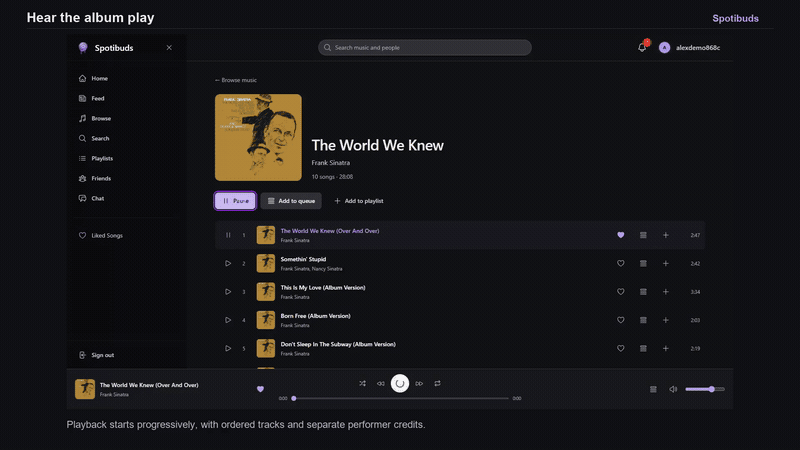

<h1 align="center">Spotibuds</h1>

Discover music, make it yours and share it with friends.

Albums and playback · Favorites and playlists · Listening feed · Friends and live chat

## Watch the app in action

Play a recording below and unmute to hear the music. All six demos are visible on this page.

### Overview · 1:16

Listen, collect, react and chat across desktop and mobile in 76 seconds.

https://github.com/user-attachments/assets/e77e37b6-90f7-4a4f-bab4-9d27be7a8e78

### Discover and listen · 1:54

Search music and people, explore artists and albums, and control playback and the queue on desktop and mobile.

https://github.com/user-attachments/assets/46847f3f-ade7-4c8e-ab09-19c5ffa80536

### Favorites and playlists · 0:57

Save favorites, create a playlist, edit its cover and visibility, reorder tracks and check persistence after reload.

https://github.com/user-attachments/assets/a4ca6f5b-31b1-4037-a924-0c9cb51af75e

### Feed and listening profiles · 1:42

Play from the listening feed, react to activity, see who reacted and explore listening profiles and shared tastes.

https://github.com/user-attachments/assets/71aa5a37-a19e-4dab-b31d-fbe0c263c614

### Friends, chat and notifications · 1:24

Send and accept friend requests, exchange messages between desktop and mobile, and check receipts, saved history and notifications.

https://github.com/user-attachments/assets/2e04e1f5-ab94-49f5-847f-b6135ca6d42f

### Accounts and administration · 1:46

Register, edit profiles, avatars and privacy, and preview administration screens. Catalogue writes and role changes are not saved.

https://github.com/user-attachments/assets/ddf68cbf-700a-4269-8efe-8535aeca6b93

## The implementation, briefly

Next.js, React and TypeScript on the frontend. Three ASP.NET Core services separate identity, music and social activity. PostgreSQL stores accounts; MongoDB stores catalogue and social data. SignalR delivers live chat and notifications. Docker services run behind Caddy, with media in Azure Blob Storage.

- One player keeps its state across views; byte-range media delivery supports progressive playback and seeking.
- Messages persist on the server, with delivery acknowledgements and read receipts between independent sessions.
- Access tokens stay in memory; refresh credentials use HttpOnly cookies.

## Verification and setup

The recorded source passed **234 frontend tests**, TypeScript checks, ESLint and a production build, followed by **31 live checks**. [Verification record](https://github.com/Spotibuds/Frontend/blob/main/docs/portfolio/showcase-verification.json).

Actual browser recordings with existing catalogue music and synthetic participants. Mobile footage shows the responsive web app. Captions are visible in the footage and listening scenes include captured music. Administration writes are previews; production recovery email needs a relay. Device and load testing remain scoped.

[Run locally](https://github.com/Spotibuds/Frontend/tree/main/demo) · [Architecture and source](https://github.com/Spotibuds/Frontend/tree/main/docs/portfolio) · [Recordings, captions and chapters](https://github.com/Spotibuds/Frontend/releases/tag/demo-suite-2026-10-05)
